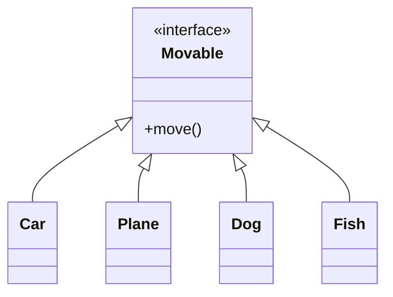
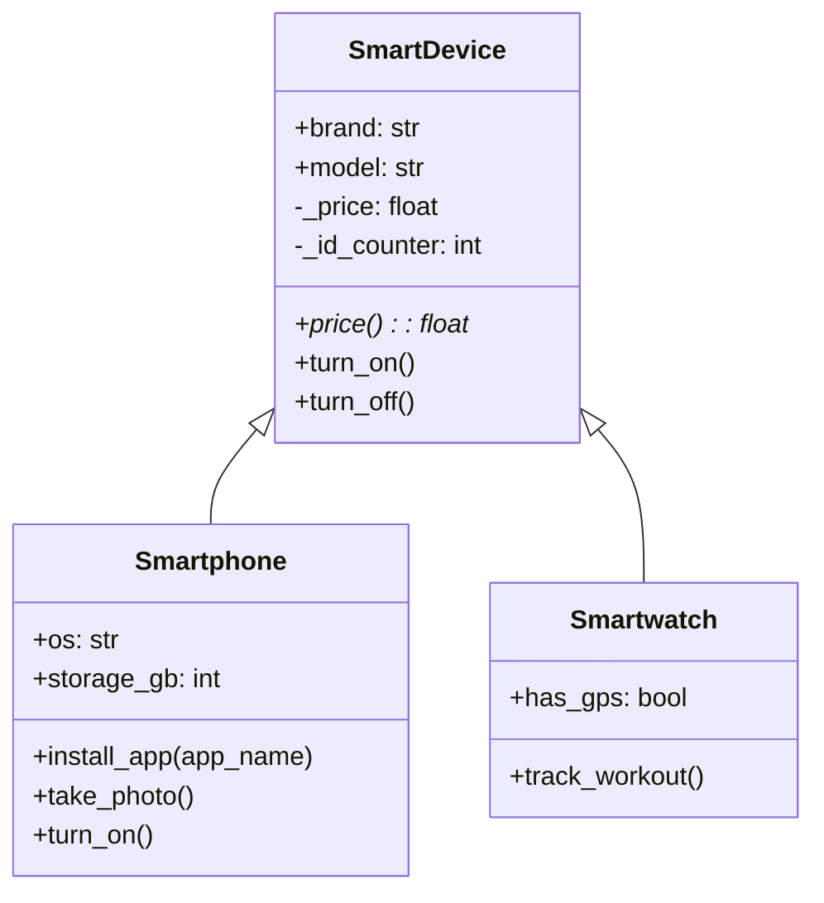

# Python OOP Concepts Demonstration

Two Python files demonstrating key Object-Oriented Programming concepts:

## 1. polymorphism_challenge.py
### Concept: Polymorphism
- Defines a `Movable` interface with a `move()` method that raises `NotImplementedError` if not overridden.
- Four classes (`Car`, `Plane`, `Dog`, `Fish`) implement the `Movable` interface, each providing its own `move()` behavior.
- A polymorphic function `start_journey(movable: Movable)` demonstrates how different objects can be treated uniformly.

### Class Diagram


### Usage
```python
from polymorphism_challenge import Car, Plane, Dog, Fish, start_journey

vehicles = [Car(), Plane(), Dog(), Fish()]
for v in vehicles:
    start_journey(v)
```

### Output
```
🚗 Driving on the road...
✈️ Flying in the air...
🐕 Running on four legs...
🐟 Swimming in water...
```

## 2. smart_devices.py
### Concepts
- **Inheritance**: `SmartDevice` is the base class for `Smartphone` and `Smartwatch`.
- **Encapsulation**: 
    - Protected attributes (e.g., `_price`, `_device_id`) are used to restrict direct access.
    - A read-only property `price` provides controlled access to the `_price` attribute.
    - A class variable `_id_counter` (protected) is used to generate unique device IDs.
- **Polymorphism**: 
    - The `Smartphone` class overrides the `turn_on()` method of the base class and extends it with additional behavior.
- **Class variables**: `_id_counter` is a class-level variable that increments for each new device.

### Class Diagram


### Usage
```python
from smart_devices import Smartphone, Smartwatch

phone = Smartphone("Google", "Pixel 9", 899.0, "Android 15", 256)
watch = Smartwatch("Samsung", "Galaxy Watch 7", 299.0, True)

phone.turn_on()
phone.take_photo()
watch.turn_on()
watch.track_workout()
```

## Running the Demos
Execute either file directly:
```bash
python polymorphism_challenge.py
python smart_devices.py
```

## Requirements
- Python 3.6+